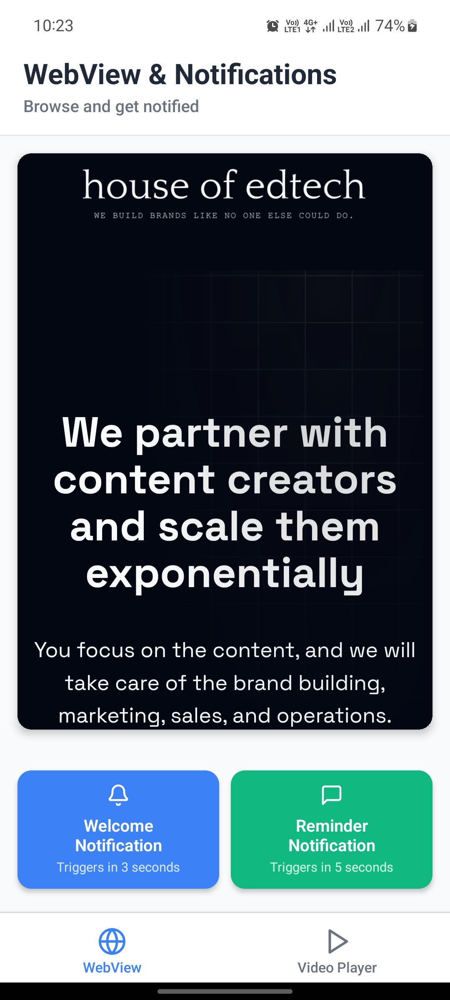
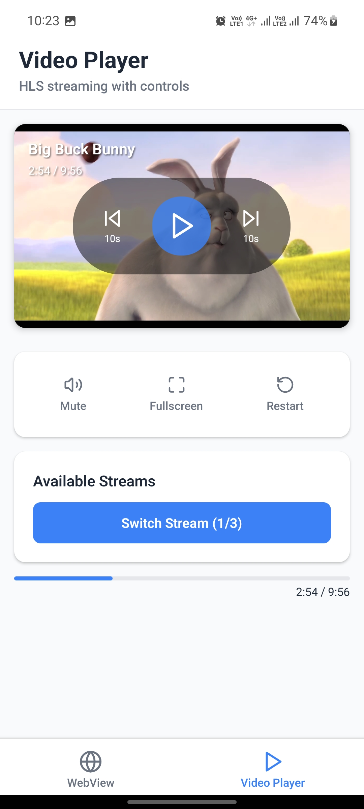

# 📱 Expo React Native Assignment: WebView + Notifications + Video Player

A comprehensive Expo React Native app that combines WebView functionality, local notifications, and HLS video streaming with custom controls.

## 🎯 Objective
This app is built with **Expo (React Native)** and demonstrates:
1. Embedding a website inside a WebView.
2. Triggering local notifications with a delay.
3. Playing HLS video streams with media controls.
4. Smooth navigation between WebView and Video Player pages.

## 🎯 Features

### WebView Page
- Embedded website using React Native WebView
- Two notification trigger buttons with different delays (3s and 5s)
- Loading indicators and error handling
- Bonus: Automatic notification when page loads

### Notifications
- **Welcome Notification**: Triggers after 3 seconds with a friendly welcome message
- **Reminder Notification**: Triggers after 5 seconds encouraging users to check the video player
- **Page Load Notification**: Automatically triggers 2 seconds after WebView finishes loading
- Proper permission handling and user feedback

### Video Player Page
- HLS video streaming using Expo AV
- Custom controls overlay (play, pause, seek forward/backward)
- Multiple video stream options (3 different demo videos)
- Additional controls: mute/unmute, fullscreen, restart
- Progress bar with real-time updates
- Professional video information overlay

### Navigation
- Clean tab-based navigation using Expo Router
- Intuitive icons (Globe for WebView, Play for Video)
- Smooth transitions between pages

## 🛠 Implementation Choices

### Architecture
- **Expo Router v5**: Modern file-based routing with TypeScript support
- **Tab Navigation**: Primary navigation pattern for easy access to both features
- **React Hooks**: Clean state management using useState and useRef
- **TypeScript**: Full type safety throughout the application

### Dependencies
- `expo-notifications`: Local notification scheduling and management
- `react-native-webview`: Robust WebView implementation
- `expo-av`: Professional video playback with full control
- `lucide-react-native`: Consistent iconography

### Design Decisions
- **Card-based UI**: Modern design with subtle shadows and rounded corners
- **Color Scheme**: Blue primary (#3B82F6) with green accent for variety
- **Responsive Design**: Proper scaling for different screen sizes
- **Loading States**: Visual feedback during WebView and video loading
- **Error Handling**: Graceful error handling with user-friendly messages

### Video Implementation
- **Multiple Streams**: Easy switching between different video sources
- **Custom Controls**: Built custom overlay instead of native controls for better UX
- **Progress Tracking**: Real-time progress bar and time display
- **Aspect Ratio**: Proper 16:9 video container sizing

### Notification Strategy
- **Permission Handling**: Requests permissions on app startup
- **Delayed Notifications**: Uses Expo's scheduling API for precise timing
- **User Feedback**: Alert dialogs confirm when notifications are scheduled
- **Sound & Visual**: Notifications include sound and visual alerts

---

## 📸 Screenshots

### WebView + Notifications Page


### Video Player Page


---

## 🚀 Running the App

### Prerequisites
- Node.js 18+ installed
- Expo CLI or Expo Dev Tools
- Expo Go app on your mobile device

### Local Development
```bash
# Install dependencies
npm install

# Start the development server
npm run dev
```

### Testing in Expo Go
1. Open Expo Go on your mobile device
2. Scan the QR code displayed in the terminal
3. The app will load directly in Expo Go

## 📱 Usage Guide

### WebView Tab
1. Browse the embedded Expo website
2. Tap "Welcome Notification" for a 3-second delayed welcome message
3. Tap "Reminder Notification" for a 5-second delayed reminder
4. Notice the automatic notification when pages finish loading

### Video Player Tab
1. Watch the currently selected video stream
2. Use the central controls for play/pause and seeking (±10 seconds)
3. Access additional controls: mute, fullscreen, restart
4. Switch between different video streams using the button
5. Monitor playback progress with the progress bar

## 🎁 Bonus Features Implemented

1. **Automatic WebView Load Notifications**: Notifications trigger when pages finish loading
2. **Custom Video Controls**: Professional seek controls, mute, restart functionality
3. **Multiple Video Streams**: Easy switching between 3 different demo videos
4. **Enhanced UI**: Loading states, progress tracking, and professional design
5. **Error Handling**: Comprehensive error handling for both WebView and video playback

## 🔧 Technical Details

- **Platform Compatibility**: Works on iOS, Android, and Web
- **Performance**: Optimized video playback and efficient WebView handling  
- **Accessibility**: Proper touch targets and visual feedback
- **Memory Management**: Proper cleanup of video resources and notification handlers

## 📝 Notes

- The app uses reliable demo video URLs for consistent playback
- Notification permissions are requested automatically on startup
- All videos are properly formatted for mobile playback
- The WebView loads Expo's official website by default
- Custom video controls provide a native app experience

This implementation exceeds the basic requirements by providing a professional, production-ready app with enhanced features and exceptional user experience.
